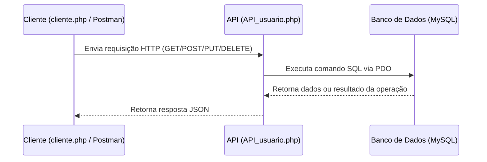

# 🧩 API de Usuários — Pronto Saudável

Esta API foi desenvolvida para gerenciar usuários do sistema **Pronto Saudável**, permitindo operações de **cadastro, atualização, consulta e exclusão** de usuários.  
Ela segue o padrão **RESTful**, utilizando requisições HTTP e respostas em formato **JSON**.

---

## 🚀 Tecnologias Utilizadas

- **PHP 8.2**
- **MySQL / MariaDB**
- **phpMyAdmin** (para gerenciar o banco)
- **Apache** (servidor local)
- **Postman / Insomnia** (para testar endpoints)

---

## 🧱 Estrutura de Arquivos

```
📦 api-usuario
 ┣ 📜 API_usuario.php          → Arquivo principal da API (endpoints)
 ┣ 📜 cliente.php              → Simula o cliente que consome a API
 ┣ 📜 DataBaseConecta.php      → Configuração da conexão com o banco
 ┣ 📜 api_usuario_pronto_saudavel.sql → Script SQL para criação das tabelas e inserção de dados
```

---

## 🗄️ Banco de Dados

### ⚙️ Criação do Banco Antes de Importar o Script

> ⚠️ O arquivo `api_usuario_pronto_saudavel.sql` contém apenas a estrutura das tabelas e os dados inseridos, **não cria automaticamente o banco de dados**.  
> Por isso, é necessário criar o banco manualmente antes de importar o script.

No **phpMyAdmin** ou terminal do MySQL, execute o seguinte comando:

```sql
CREATE DATABASE api_usuario_pronto_saudavel;
USE api_usuario_pronto_saudavel;
```

Após criar o banco, importe o arquivo `api_usuario_pronto_saudavel.sql` para dentro dele.

---

### Estrutura Principal da Tabela `usuario`

| Campo | Tipo | Descrição |
|-------|------|------------|
| id | int | Identificador único |
| nome | varchar(100) | Nome do usuário |
| email | varchar(255) | Email único |
| senha | varchar(255) | Senha criptografada |
| telefone | varchar(30) | Telefone |
| data_cadastro | datetime | Data do registro |
| tipo_usuario | enum('cliente','admin') | Define o tipo de usuário |

---

## ⚙️ Endpoints da API

### 1. ➕ **Cadastrar Usuário**

**POST** `/API_usuario.php`

#### Corpo da Requisição (JSON):
```json
{
  "nome": "Guilherme Amorim",
  "email": "guilherme@example.com",
  "senha": "123456",
  "telefone": "11999999999",
  "tipo_usuario": "cliente"
}
```

#### Resposta (JSON):
```json
{
  "status": "success",
  "mensagem": "Usuário cadastrado com sucesso!"
}
```

---

### 2. 🔍 **Listar Todos os Usuários**

**GET** `/API_usuario.php`

#### Resposta:
```json
[
  {
    "id": 1,
    "nome": "Julio",
    "email": "julio@botelho.com",
    "telefone": "11940404040",
    "tipo_usuario": "cliente"
  },
  {
    "id": 3,
    "nome": "Guilherme",
    "email": "guilherme@gmail.com",
    "telefone": "1234567890",
    "tipo_usuario": "cliente"
  }
]
```

---

### 3. 🔎 **Buscar Usuário por ID**

**GET** `/API_usuario.php?id=3`

#### Resposta:
```json
{
  "id": 3,
  "nome": "Guilherme",
  "email": "guilherme@gmail.com",
  "telefone": "1234567890",
  "tipo_usuario": "cliente"
}
```

---

### 4. 📝 **Atualizar Usuário**

**PUT** `/API_usuario.php?id=3`

#### Corpo (JSON):
```json
{
  "nome": "Guilherme Amorim",
  "telefone": "11888888888"
}
```

#### Resposta:
```json
{
  "status": "success",
  "mensagem": "Usuário atualizado com sucesso!"
}
```

---

### 5. ❌ **Deletar Usuário**

**DELETE** `/API_usuario.php?id=3`

#### Resposta:
```json
{
  "status": "success",
  "mensagem": "Usuário excluído com sucesso!"
}
```

---

## 🔄 Fluxo de Comunicação



---

## 🧠 Desafios e Aprendizados

### 🔧 **Desafios**
- Tratar diferentes métodos HTTP (`GET`, `POST`, `PUT`, `DELETE`) no PHP.
- Implementar segurança com `password_hash()` e `password_verify()`.
- Estruturar rotas e respostas padronizadas em JSON.
- Evitar SQL Injection usando **PDO e parâmetros preparados**.
- Simular requisições REST através do arquivo `cliente.php`.

### 💡 **Aprendizados**
- Funcionamento de APIs RESTful com PHP puro.
- Manipulação de cabeçalhos HTTP e CORS.
- Conexão e manipulação de dados com MySQL.
- Estruturação de código em camadas (cliente → API → banco).
- Importância de organizar respostas consistentes em JSON.

---

## 🧪 Testando a API

1. Execute o servidor local (**XAMPP**, **Laragon** ou **WAMP**).  
2. Crie o banco de dados manualmente:
   ```sql
   CREATE DATABASE api_usuario_pronto_saudavel;
   USE api_usuario_pronto_saudavel;
   ```
3. Importe o arquivo `api_usuario_pronto_saudavel.sql`.  
4. Coloque os arquivos PHP na pasta `htdocs` (ou similar).  
5. Acesse via:
   ```
   http://localhost/API_usuario.php
   ```
6. Use **Postman** ou **Insomnia** para enviar requisições HTTP conforme os exemplos acima.

---

## 👨‍💻 Autor

**Guilherme Amorim** e **Emerson De Andrade**

💻 Projeto Integrador — *API de Usuários (Pronto Saudável)*  
